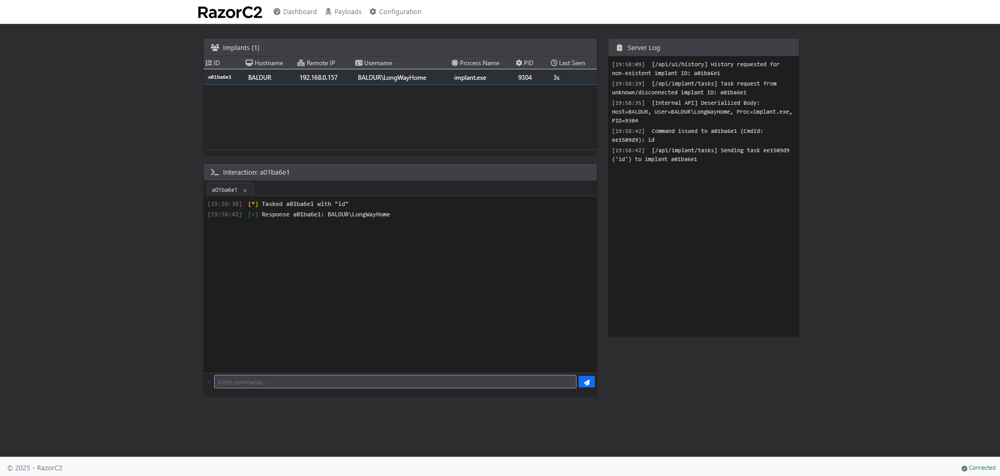
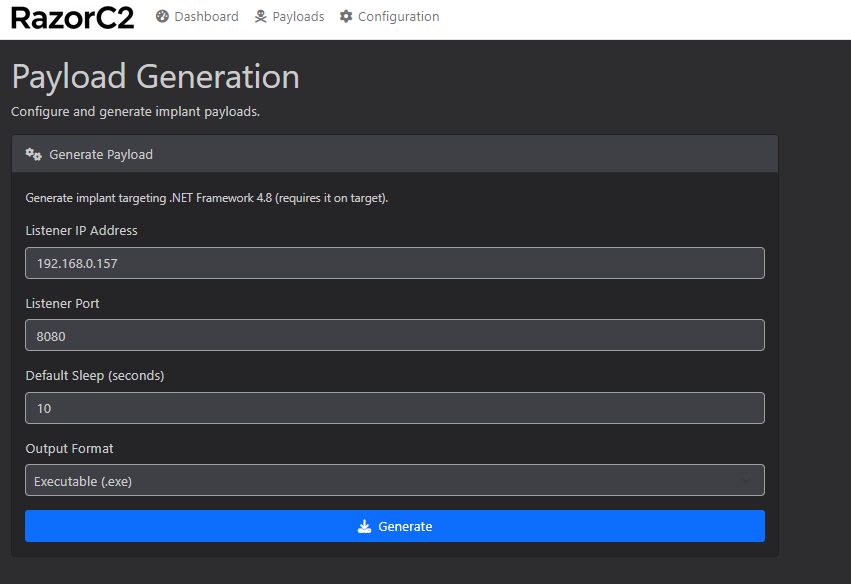
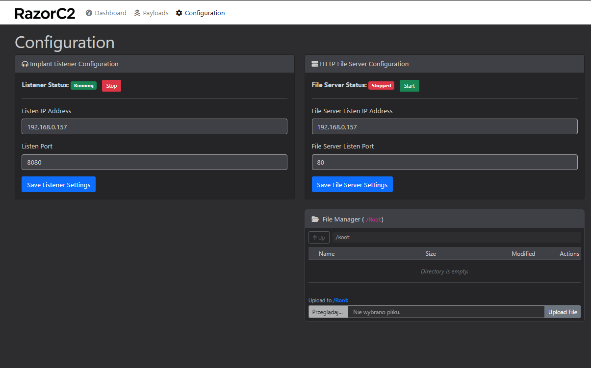

# RazorC2 - A .NET 8 Command & Control (C2)

-lightgrey)
## Introduction

RazorC2 is a proof-of-concept Command & Control (C2) framework built entirely in C# using .NET 8. It serves as a learning project exploring LLM like Gemini 2.5 Pro capabilities to create code, including:

*   Modular architecture with separate processes for core C2, implant listener, payload generation, and file serving.
*   Real-time UI updates using ASP.NET Core SignalR.
*   Web interface built with ASP.NET Core Razor Pages.
*   Basic implant generation targeting .NET Framework 4.8 (for compatibility).
*   Process management within the C2.
*   Modern .NET features like Minimal APIs and `IHttpClientFactory`.

To create this C2, nearly ~1.5 million tokens were used to implement and debug the application. Insights from building this application suggest that the current Gemini 2.5 Pro model (Experimental 03-25) is capable of kickstarting a C# project and supporting its dynamic development. However, as the codebase grows, the model tends to lose track of context and occasionally alters correctly implemented code, misinterpreting working functions as problematic. Despite these issues, the model remains a valuable tool for rapidly generating code and solving problems throughout the application development process.

## Disclaimer 
This is **Proof Of Concept:** software. It is intended strictly for **educational and research purposes**. It wasn't audited for any security vulnerabilities. Usage of this software is entirely at your own risk. The author is not responsible for any misuse or damage caused by this software. This project was developed primarily for educational purposes to understand C2 mechanics and practice C#/.NET development. Most of the code was produced using `Gemini 2.5 Pro Experimental Preview 03-25` model via Google AI Studio. 

## Images

## Features

*   **Modular Design:** Components run as separate processes managed by the main C2 application.
*   **Web UI:** Built with Razor Pages and SignalR for real-time updates of implant check-ins, task status, and logs.
*   **Implant Management:** Basic tracking of implant check-ins.
*   **Tasking:** Queue commands for specific implants,
*   **Process Management:** UI controls to Start/Stop Listener, File Server processes.
*   **Payload Generation:** Basic .NET Framework 4.8 EXE implant generation via a dedicated service. Configures C2 callback URL and default sleep time.
*   **HTTP Listener:** Dedicated process forwards implant traffic to the main C2 API.
*   **HTTP File Server:** Dedicated process for serving files (e.g., implant downloads) and handling file uploads from implants. Includes a basic file manager UI on the Configuration page.
*   **Configuration:** Edit Listener and File Server IP/Port settings via the UI (requires restart of the respective service).
*   **Logging:** Uses Serilog for logging to console and rolling files for each component.

## Architecture

RazorC2 uses a multi-process architecture:

1.  **`RazorC2.exe` (Main C2 Process):**
    *   Hosts the ASP.NET Core web application (Razor Pages UI, SignalR Hub, internal APIs).
    *   Contains the `ImplantManagerService` for tracking implants and tasks (in-memory).
    *   Contains the `ProcessManagerService` to start/stop/monitor the other child processes.
    *   On default it's listening on `http://localhost:5000` for the operator UI.
2.  **`ImplantListenerService.exe` (Listener Process):**
    *   Listens on a configured IP/Port (e.g., `0.0.0.0:8080`) for incoming implant connections on `/api/implant` endpoint.
    *   Acts as a simple reverse proxy, forwarding implant requests to the main C2 internal API (`/razor-int/...`) while adding `X-Forwarded-For` headers.
3.  **`PayloadGenerationService.exe` (Payload Geneneration Process):**
    *   Exposes a simple API (e.g., `http://localhost:5001/generate`) called by the C2 UI.
    *   Compiles the `ImplantSource.cs` template (using `dotnet publish`), embedding the C2 URL and sleep time.
    *   Uses `Costura.Fody` to embed dependencies into the resulting `.NET Framework 4.8` implant executable.
4.  **`HttpFileServerService.exe` (File Server Process):**
    *   Hosts a minimal Kestrel server to serve files from a specified directory (`file_server_root` by default).
    *   Listens on a configured IP/Port (e.g., `0.0.0.0:8081`).
    *   Used by implants for file downloads (via the C2 `download` command which uploads to the C2 first) and potentially could be used to host payloads.

**Communication Flow (Simplified):**

*   **Implant:** Connects to `ImplantListenerService`.
*   **Listener:** Forwards request to `RazorC2` internal API.
*   **RazorC2:** Updates `ImplantManagerService`, interacts with UI via SignalR, queues tasks.
*   **Operator:** Interacts with `RazorC2` Web UI.
*   **Payload Request:** UI calls `PayloadGenerationService` API.
*   **File Operations:** C2 UI uses File Server via Configuration Page;

## Technologies Used

*   **.NET 8:** Core framework for C2, Listener, Payload Gen, File Server.
*   **C#:** Primary programming language.
*   **ASP.NET Core:** Web framework for UI and APIs.
    *   **Razor Pages:** Server-side UI rendering.
    *   **SignalR:** Real-time web communication (UI updates).
    *   **Minimal APIs:** Used for internal C2<->Listener communication and UI API endpoints.
    *   **Kestrel:** Web server.
*   **.NET Framework 4.8:** Target framework for the generated implant (for wider Windows compatibility).
*   **Newtonsoft.Json:** JSON serialization/deserialization (used across components).
*   **Serilog:** Structured logging framework (Console and File sinks).
*   **Costura.Fody:** Used by `PayloadGenerationService` to embed dependencies into the .NET Framework implant EXE.
*   **MSBuild:** Used extensively in `.csproj` files to automate the publishing and copying of dependent service executables.

## Prerequisites

*   **.NET 8 SDK:** Required to build and publish the projects.
*   **.NET Framework 4.8 Targeting Pack:** Required by `PayloadGenerationService` if not already installed with Visual Studio.
*   **Visual Studio 2022:** Includes the necessary SDKs and build tools. Development was done using VS 2022.
*   **Target Runtime:** The publish process creates framework-dependent executables. The machine running the published components needs the corresponding **.NET 8 Runtime** installed.

## Setup & Building

1.  **Clone:** Clone this repository: `git clone https://github.com/LongWayHomie/RazorC2.git`
2.  **Open:** Open the `RazorC2.sln` file in Visual Studio 2022.
3.  **Restore:** Restore NuGet packages (usually happens automatically, or right-click Solution -> "Restore NuGet Packages").
4.  **Build:** Build the entire solution (`Build` > `Build Solution`), preferably using the `Release` configuration. This ensures all components are compiled.
5.  **Publish `RazorC2`:**
    *   Right-click the **`RazorC2`** project in Solution Explorer.
    *   Select "Publish...".
    *   Choose "Folder" as the target.
    *   Create or edit a publish profile with the following **key settings**:
        *   **Configuration:** `Release`
        *   **Deployment mode:** `Framework-dependent`
        *   **Produce single file:** Checked
        *   **Target runtime:** Select a specific runtime (e.g., `win-x64` for 64-bit Windows). **Do not use `Portable`**.
        *   **Exclude PDBs:** Ensure `PublishDebugSymbol` is effectively `false` (this is now set in `RazorC2.csproj` and passed to dependencies).
    *   Click "Publish".
6.  **Output:** The publish process will:
    *   Compile `RazorC2`.
    *   Run the custom MSBuild targets defined in `RazorC2.csproj`:
        *   These targets will publish `ImplantListenerService`, `HttpFileServerService`, and `PayloadGenerationService` using the same Configuration/RID/SingleFile settings.
        *   They will then copy the resulting `.exe` files for these services into the final `RazorC2` publish directory.
    *   Locate the output in the folder specified by your publish profile (e.g., `.\bin\Release\net8.0\win-x64\publish\`).

**Expected Publish Output Folder Contents:**

*   `RazorC2.exe` (Bundled main application - an entrypoint to RazorC2)
*   `ImplantListenerService.exe`
*   `HttpFileServerService.exe`
*   `PayloadGenerationService.exe`
*   `appsettings.json` (application settings file)
*   `appsettings.Development.json` (if present)
*   `web.config` (for IIS compatibility, can often be ignored)
*   `wwwroot\` (folder with static UI assets)
*   `logs\` (folder, will be created on first run)
*   `file_server_root\` (folder, used by default by File Server)

## Known Limitations & Potential Future Work

*   **Security:** There's no security hardening. Needs proper input validation, output encoding, better crypto, protection against common web/C2 attacks. 
*   **Error Handling:** Basic `try-catch` blocks exist, but more robust handling of network errors, process failures, and edge cases is needed.
*   **Persistence:** Implants and tasks are stored in memory; they are lost when the C2 restarts. Needs a database backend.
*   **Implant Features:** Implant is basic .NET Framework. Nothing more, nothing less.
*   **Scalability:** In-memory storage and simple tasking won't scale to many implants.
*   **Configuration:** Direct JSON editing works but isn't ideal. Options pattern or a dedicated config service could be better. `ProcessManagerService` relies on hardcoded EXE names.
*   **UI/UX:** Functional but basic. 
*   **Evasion:** There's none.